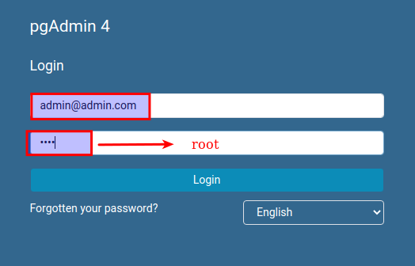
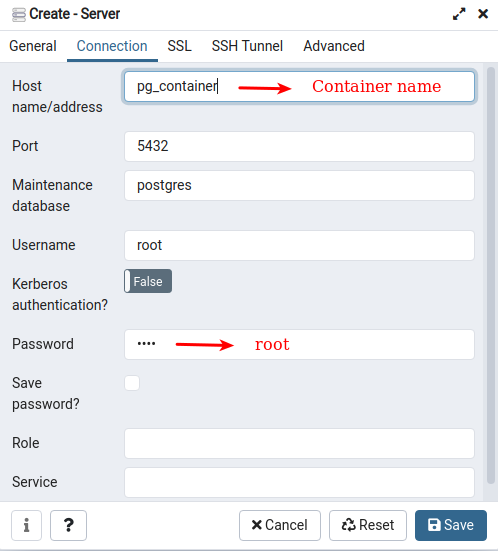
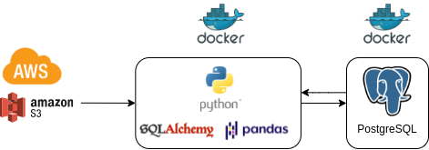

### 

<p align="center">

  <h3 align="center">Coderio challenge</h3>

  <p align="center">
    <a href="https://github.com/Luisarg03/Streamlit-CryptoCurrency/issues">Report Bug</a>
  </p>
</p>

<!-- ABOUT THE PROJECT -->
## Sobre el proyecto

Desarrollo de pipeline como respuesta al challenge de _Coderio.
El pipeline en desarollo integra:
* AWS s3 como fuente de datos
* Python como extractor y orquestador del flujo de datos.
    - Boto3, SDK de AWS, para conexion y manejo de los servicios cloud
    - Sqlalchemy para conexiones y ejecucion de scripts sql
    - Pandas para manipulacion de datos
* Postgres
* Pgadmin, interface de la base de datos
* Docker como el integrador
* Docker compose para el despliegue

### Pre-requisitos

* Docker version 20.10.8
* Docker-compose version 1.29.2

### Init

1. Clone the repo
   ```sh
   git clone https://github.com/Luisarg03/ChallengeCoderio.git
   ```
2. Create containers on distros Linux
   ```sh
   sudo docker-compose up
   ```
3. Una vez deplago los contenedores se podra acceder a Pgadmin desde:
   ```sh
   localhost:5050
   ```
#### LOGIN:
  * user: _admin@admin.com_
  * password: _root_



#### SERVER
  * host: _pg_container_
  * port: _5432_
  * user: _root_
  * password: _root_



---
<!-- USAGE EXAMPLES -->
## Pipeline roadmap




---
<!-- MISSING TASKS-->
## tareas que faltan completar

* Update automatico sobre el esquema WH
* Generar tabla de logeo de actividades
* Minimizar codigo en los distintos modulos
* Analisis de las tablas FCT en los esquemas correspondientes
* Mejorar rendimiento de pipeline


<!-- CONTRIBUTING -->
## Contribucion

1. Fork the Project
2. Create your Feature Branch (`git checkout -b feature/AmazingFeature`)
3. Commit your Changes (`git commit -m 'Add some AmazingFeature'`)
4. Push to the Branch (`git push origin feature/AmazingFeature`)
5. Open a Pull Request


<!-- LICENSE -->
## Licencia

free license for distribution 🖤


<!-- CONTACT -->
## ContactO

Name - [luisarg03](https://www.linkedin.com/in/luisarg03/)

Project Link: [https://github.com/Luisarg03/ChallengeCoderio](https://github.com/Luisarg03/ChallengeCoderio)
