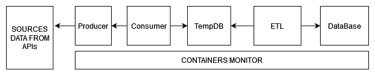
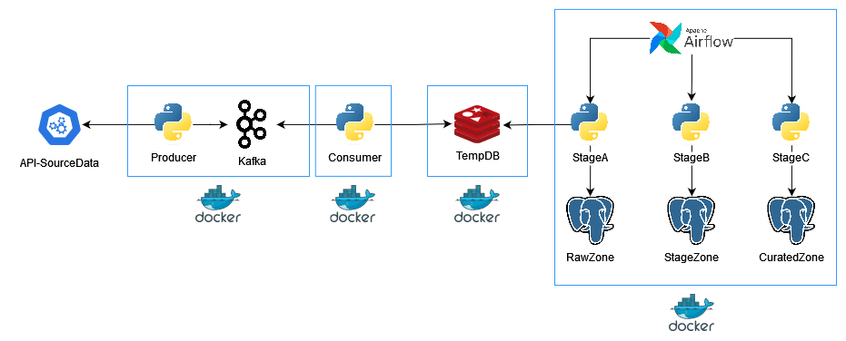

# Kafka-Learning

Proyecto personal para aprender a trabajar con Apache Kafka e implementarlo en un sistema de ingesta de datos real-time.

## Concepto de sistema

## Arquitectura

### Componentes

- **API**: Punto de entrada para los datos, API de aplicativo de tercero.
- **Containers**: Docker para crear entorno de ejecución de aplicaciones permitiendo empaquetar y distribuir aplicaciones con todas sus dependencias.
- **Producer**: Módulo Python (`Producer-Py`) que recopila datos de la API y los disponibiliza en los topicos de Kafka.
- **Consumer**: Módulo Python (`Consumer-Py`) que consume los datos proporcionados por el `Producer`. Los datos son almacenados en `Redis`.
- **Redis**: Sistema de almacenamiento en memoria que actúa como base de datos temporal (`TempDB`) para los datos consumidos.
- **Airflow**: Orquestador de flujos de trabajo que gestiona y automatiza los procesos de tratamiento de datos.
  - **RawZone**: Primera capa de procesamiento donde los datos aterrizan desde `Redis`.
  - **StageZone**: área intermedia para el procesamiento de datos.
  - **CuratedZone**: Capa donde los datos están listos para ser utilizados por aplicaciones finales.
- **DB-Postgres**: Base de datos PostgreSQL que almacena datos en las diferentes capas (Esquemas `RAW`, `STG`, `CUR`).

### Requisitos
- 
## Instalación
- 
## Uso
- 
