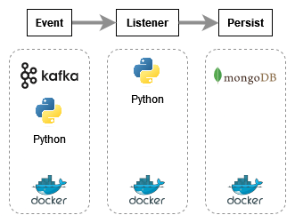

# Real-time Hardware Metrics Monitoring Pipeline

This project is a proof of concept for a data pipeline that monitors real-time hardware metrics. It utilizes Kafka, Python, and MongoDB, all running within Docker containers.

## Overview

The goal of this project is to demonstrate how to collect and process hardware metrics in real-time using a scalable and fault-tolerant architecture. The pipeline consists of the following components:

- **Kafka**: A distributed streaming platform that acts as a message broker for real-time data ingestion.
- **Python**: A programming language used to develop the data processing logic.
- **MongoDB**: A NoSQL database used to store and analyze the processed metrics.

## Architecture (MVP1)
The architecture of the real-time hardware metrics monitoring pipeline (MVP1) is illustrated in the diagram above. It consists of the following components:

The data flow starts with the hardware metrics being collected and sent to Kafka topics. The Python consumer application reads the data from Kafka, processes it, and stores it in MongoDB for further analysis.

## Usage

## Contributing

Contributions are welcome! If you have any ideas or improvements, please submit a pull request or open an issue.

## License