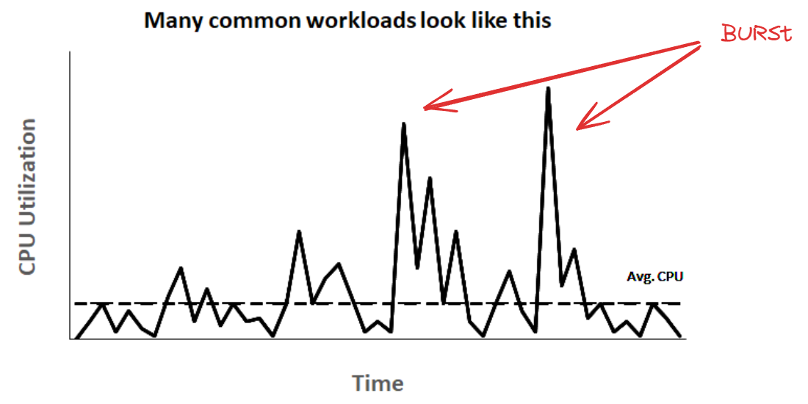

# Build With EC2
---
## Basic EC2

- Más de 400 tipos de instancias
- Son VMs (Máquinas Virtuales)

#### Tipos de Instancias

- **Concepto**: La combinación de los componentes de hardware virtuales.
- Se agrupan en "INSTANCE FAMILIES" (Familias de instancias). Cada familia tiene optimización para casos de usos específicos.
- Cada familia tiene subfamilias, acorde a la combinación de procesador y almacenamiento.
- **Cálculo de vCPU (Virtual Central Processing Units)**: Medida de procesamiento.
  - 2 CPUs y 2 hilos por core = 4 vCPUs.
  - 2 CPUs con dos hilos cada uno.

#### Arquitectura de Instancias

- **Intel**: c5, m5, r5
- **AMD**: c5a, m5a, t3a
- **ARM (Graviton)**: c6g, m6g

Dependiendo de la carga de trabajo, seleccionar una u otra trae beneficios.

- **C** (Compute optimized): Ejemplo: c5.2xlarge – 16 GiB memory y 8vCPU (2:1) -> **Ratio 2:1**: Ratio de memoria a vCPU es de 2 GiB por vCPU.
- **M** (General purpose): Ejemplo: m5.2xlarge – 32 GiB memory y 8vCPU (4:1)
- **R** (Memory optimized): Ejemplo: r5.2xlarge – 64 GiB memory y 8vCPU (8:1)

#### Familias de Instancias

- **General Purpose (M y T)**: Balance entre recursos. Para una amplia gama de tipos de trabajo (ej. Web Server, Repositorio de código).
- **Burstable Instance Options (T)**: Cargas de trabajo que no están ocupadas todo el tiempo y no requieren demasiado rendimiento de la CPU. Usar instancias demasiado grandes y de alto rendimiento sería un desperdicio. Pueden usarse instancias de propósito general para estas cargas. Son económicas y tienen capacidad de ráfaga (cubrir picos de carga).

#### Compute optimized (C)
- Dedicadas al procesamiento con alto rendimiento, cargas de trabajo con mucho procesamiento.
  - Ejemplos:
    - Procesamiento batch: Procesamiento de grandes volúmenes de datos de una vez.
    - Servidores web con mucho tráfico.
    - Crear modelos científicos y simulaciones.
    - Servidores de juegos con alto rendimiento.
    - Inferencias ML para obtener resultados rápidamente.

#### Memory optimized (R)
- Dedicadas al procesamiento de datos en memoria de grandes volúmenes de datos. Rendimiento rápido para ejecutar operaciones en los sets de datos.
  - Ejemplos:
    - DB relacionales y NoSQL (Para grandes volúmenes, ambos casos).
    - DB en cache, Redis, Memcache, etc.
    - Procesamiento en tiempo real con Spark, Hadoop.
    - Procesos que requieran mucha memoria para cálculos complejos.

#### Storage optimized (I)
- Optimizadas para cargas de trabajo que requieran un alto rendimiento en lectura y escritura de almacenamiento local para operaciones con conjuntos de datos.
  - Ejemplos:
    - Procesamiento masivo paralelo.
    - Procesamiento distribuido con MapReduce o Hadoop.
    - DB NoSQL: Acceso rápido a grandes volúmenes de transacciones.
    - Cache en memoria: Ej. Redis.
    - DataWarehouses.

#### Accelerate compute (P y G)
- Utilizan aceleradores de hardware (co-procesadores) (Tarjetas gráficas).
  - Ejemplos:
    - Cálculos con comas flotantes.
    - Procesamiento de gráficos.
    - Coincidencia con patrones de datos.
    - Procesamiento paralelo en alto rendimiento.

### Casos de uso

- **Renderizado de video**
- **Procesamiento de video**
- **Big Data**: Análisis de grandes volúmenes de datos
- **IA y Machine Learning**: Entrenamiento e inferencia para modelos que requieran alto rendimiento.

### Decodificación del Nombre de la Instancia

Ejemplo: `m5zn.xlarge`

- **Familia (Family)**: `m` - Indica el tipo de instancia. En este caso, `m` -> instancias de propósito general.
- **Generación (Gen)**: `5` - Indica la generación de la instancia.
- **Opcional: `z`** - Alta frecuencia (High Frequency), mejor rendimiento en los hilos/Threads.
- **Opcional: `n`** - Características de red (Network feature) para alto rendimiento y baja latencia en red.
- **Tamaño (Size)**: `xlarge` - Indica el tamaño de la instancia, lo cual afecta la cantidad de RAM y núcleos de CPU. AWS utiliza distintos tamaños como small, medium, large, xlarge, etc.