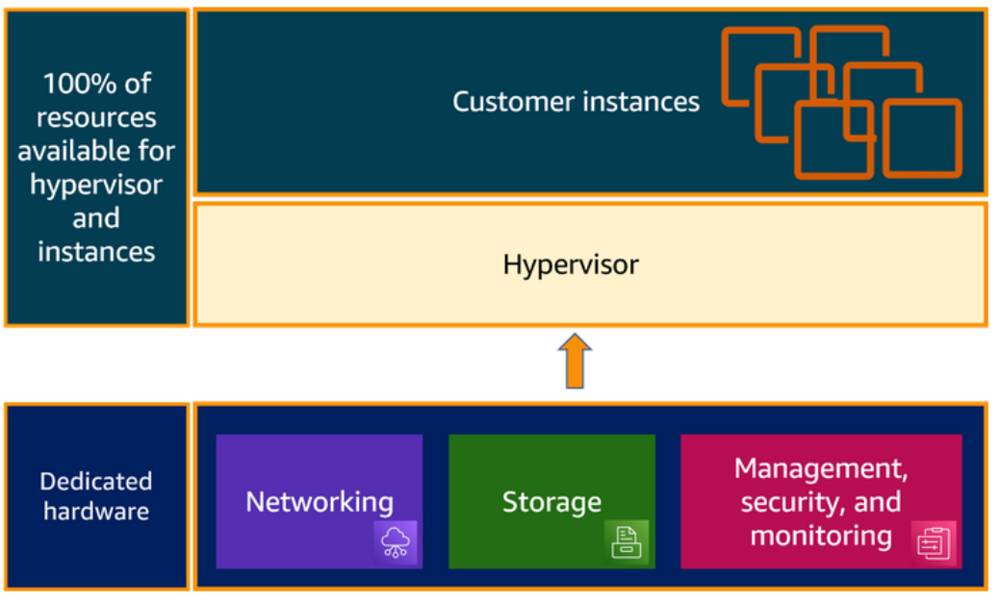
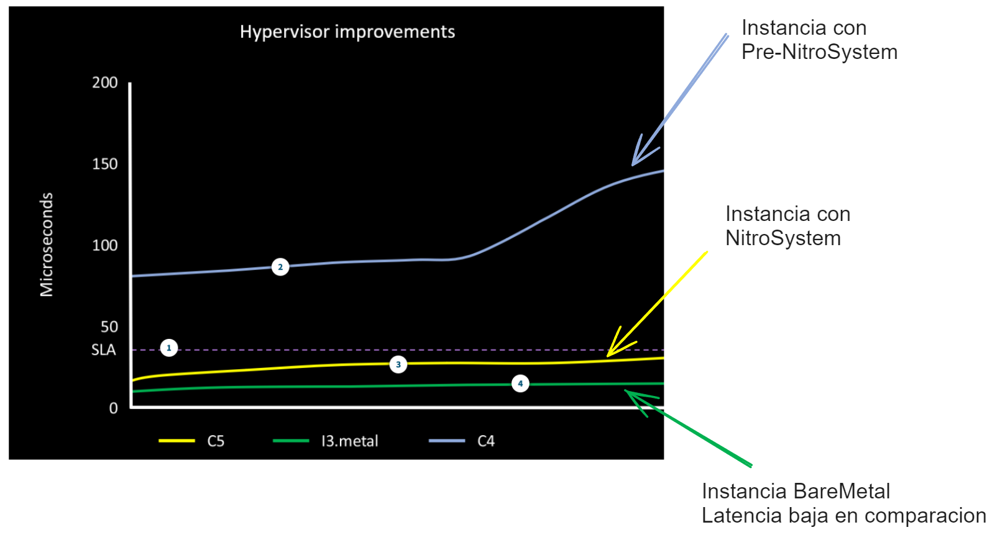

## AMIs

- Plantillas que contienen la configuración inicial de una instancia EC2.
- Son personalizables.
- Con los volúmenes EBS es posible guardar archivos de configuración.
- Una AMI tiene uno o varios snapshots EBS.
- Una AMI se puede adjuntar a varias instancias para generar múltiples configuraciones iguales.

#### Elementos clave en una instancia EC2

- **Hardware físico**: Componentes como almacenamiento, red y cómputo.
- **AMI (Amazon Machine Image)**: Plantilla de configuración de software que incluye el sistema operativo y aplicaciones.
- **Hypervisor**: Software que virtualiza los recursos físicos y permite que múltiples sistemas operativos se ejecuten en un solo servidor físico.

### Hypervisor

Función: Asigna recursos y gestiona el hardware físico en un entorno virtualizado.

Tipos en AWS:
- **Original Hypervisor**: Utilizado en los inicios de EC2.
- **Nitro Hypervisor**: Parte de AWS Nitro System, que mejora la innovación y la seguridad.

### AWS Nitro System

Combina hardware dedicado y un hypervisor liviano para optimizar el rendimiento de las instancias.

#### Funciones
- **Offloading**: Desvía operaciones de entrada/salida (I/O) y gestión de seguridad a hardware dedicado, liberando más recursos para las instancias.
- **Rendimiento**: Mejora el rendimiento al proporcionar casi todos los recursos del servidor a las instancias.

#### Mejoras con AWS Nitro System
- **Optimización de recursos**: En el lanzamiento original de EC2, hasta el 30% de los recursos del host se dedicaban al hypervisor, dejando solo el 70% para las instancias.
- **Nitro System**: Las funciones del hypervisor se separan y se manejan con hardware y software dedicados, aumentando el rendimiento y reduciendo costos.

### Network Interface

**Elastic Network Interface (ENI)**

- Componente lógico que representa una tarjeta de red virtual en una instancia.
- Permite la comunicación entre instancias, servidores y el internet.
- Similar a la tarjeta de red en laptops, desktops o servidores.

### Bare-Metal Instances

- Instancias Bare-Metal: No tienen software de virtualización preinstalado (hypervisor).
- **Diferencia con Dedicated Host**: Un Dedicated Host tiene el hypervisor preinstalado.

#### Aplicaciones Ideales

- Acceso a características de hardware específicas.
- Aplicaciones que requieren entornos no virtualizados.
- Clientes que desean usar su propio hypervisor.

#### Beneficios

- Cargas de trabajo especializadas que necesitan acceso directo al hardware.
- Cargas de trabajo heredadas no compatibles con entornos virtuales.
- Aplicaciones críticas de negocio con restricciones de licencias.
- Menor latencia: No tiene la sobrecarga de un hypervisor.

## AMIs

Una Amazon Machine Image (AMI) es una plantilla que contiene la configuración necesaria para lanzar una instancia en AWS. Esto incluye el sistema operativo (OS), software preinstalado y archivos de configuración. Una AMI puede ser simple (solo el OS) o compleja según las necesidades.

#### Uso de AMIs

- **Lanzar nueva instancia**: Utiliza una AMI para lanzar una nueva instancia.
- **Duplicación**: Una AMI puede ser usada para lanzar múltiples instancias idénticas.
- **Fuentes**: Las AMIs pueden ser provistas por AWS, la comunidad de AWS, comparadas en el AWS Marketplace, o creadas por el usuario.

#### Ejemplo

Puedes preinstalar instancias idénticas para una campaña. Creas una nueva instancia EC2, la personalizas y luego con esa AMI puedes lanzar las instancias necesarias.

#### Modos de Arranque

- **UEFI (Unified Extensible Firmware Interface)**:
  - Protocolo de arranque para instancias Graviton.
  - Permite verificar la identidad de los módulos de software.
  - **UEFI Secure Boot**: Asegura que solo el software firmado con claves criptográficas pueda ser ejecutado.

- **Legacy BIOS**:
  - Usado por defectos en tipos de instancia Intel y AMD.
  - Método tradicional de arranque del sistema.
  - Compatible con versiones antiguas y nuevas de Windows OS.

#### AMIs Compartidas y Públicas

- **AMIs Compartidas**: AMIs disponibles para otros usuarios. Se pueden personalizar y luego crear una nueva AMI.
- **AMIs Públicas**: AWS no garantiza la integridad o seguridad de AMIs públicas. Es recomendable obtener AMIs de fuentes confiables, como las de Amazon.

#### Consideraciones al Compartir AMIs

- **Recursos Regionales**: AMIs deben buscarse y compartirse desde la misma región.
- **Componentes Restringidos**: AMIs con volúmenes cifrados, snapshots cifrados o códigos de producto no pueden hacerse públicas.
- **Datos Sensibles**: Evitar exponer datos sensibles siguiendo las recomendaciones de seguridad.
- **Fecha de Deprecación**: Por defecto, la fecha de deprecación de AMIs públicas es de dos años desde la creación. Se puede ajustar según sea necesario.
- **Facturación**: El uso de AMIs por otras cuentas no genera costos adicionales para el propietario de la AMI; las cuentas que lanzan instancias son las que asumen los costos.

#### Resumen de Paid AMIs

Una AMI de pago es una imagen que puedes comprar en el AWS Marketplace, donde encuentras software para AWS, incluyendo AMIs organizadas en categorías. Lanzar una instancia desde una AMI de pago es igual que con cualquier otra AMI y se cobra según las tarifas del propietario de la AMI, además de las tarifas estándar de AWS.

#### Permisos de Lanzamiento

- **Permiso Público**: Permite la instancia para todas las cuentas de AWS.
- **Explícito**: Permite instancias para cuentas específicas, organizaciones o unidades organizacionales específicas.

#### EC2 Image Builder

AWS EC2 Image Builder es una herramienta que automatiza el proceso de creación y mantenimiento de AMIs. Es ideal para mantener las AMIs actualizadas con los últimos parches de seguridad y actualizaciones de software.

- **Características**:
  - Automatiza la creación y el mantenimiento de AMIs.
  - Mantiene las AMIs seguras y actualizadas automáticamente.
  - No requiere pasos manuales ni la creación de una canalización de automatización propia.
  - Image Builder es gratuito y se integra con AWS Organizations.

#### Lanzamiento de AMIs

- **Costos**: No se cobra por el uso de AMIs públicas, pero las AMIs de pago incluyen costos adicionales según el proveedor.